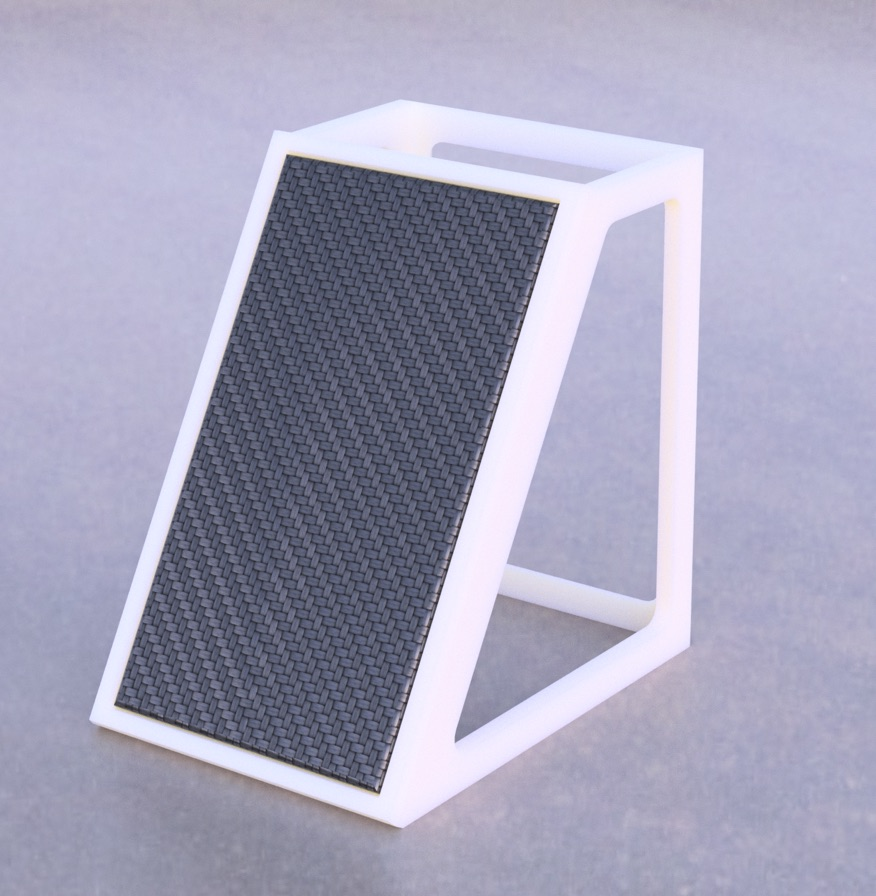

# Solar Lamp

Case and firmware for a solar lamp:

- ~6w (9v) Solar Panel
- CN3791 MPPT solar charge board (https://youtu.be/kEttqWJrdww?si=J3NK1Z9TAiQDuugP&t=113)
- 18650 Li-Ion 3.7v battery
- Arduino ItsyBitsy 3v (https://www.adafruit.com/product/3675)
- A strip of NeoPixels
- BH1750 I2C light sensor (lux)
- A single pushbutton

The firmware does the following:
- The light turns on automatically when it's dark
- Pressing the button for more than two seconds will turn the light off 
- Tapping the button will turn the light on, if it's off

Tapping the button while the light is on will cycle between four different animations. The default animation is just a warm-white light. 

## The 3d Model:

STL files used for 3d printing are included.